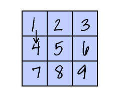

## Завдання: розшир свій світ

Далі ти можеш продовжувати створювати свій власний світ! Ось деякі ідеї:

+ Додай у свою гру більше монет у різних кімнатах. Можливо, деякі монети будуть охоронятися патрулюючими противниками?
+ Змінюй ігрові фони
+ Додай звуки і музику до своєї гри
+ Додай більше людей, противників і табличок
+ Додай червоні та жовті двері, а також спеціальні ключі, щоб відкривати їх
+ Додай більше кімнат до свого світу
+ Додай інші корисні елементи у свою гру
    
    + Використовуй монети, щоб отримувати інформацію від інших людей:


+ Ти навіть можеш додати двері в північній та південній стінах кімнати 1, щоб гравець міг рухатися між приміщеннями у всіх чотирьох напрямках. Наприклад, гра може мати дев’ять кімнати у сітці 3 на 3. Потім можна додати `3` до номера кімнати, щоб переходити вниз на один рівень.




```blocks3
if <touching color [ ]?> then
switch backdrop to ((costume [number v]) + (3))
go to x:(0) y:(200)
change [кімната v] by (3)
```