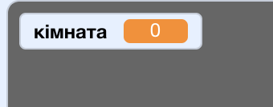
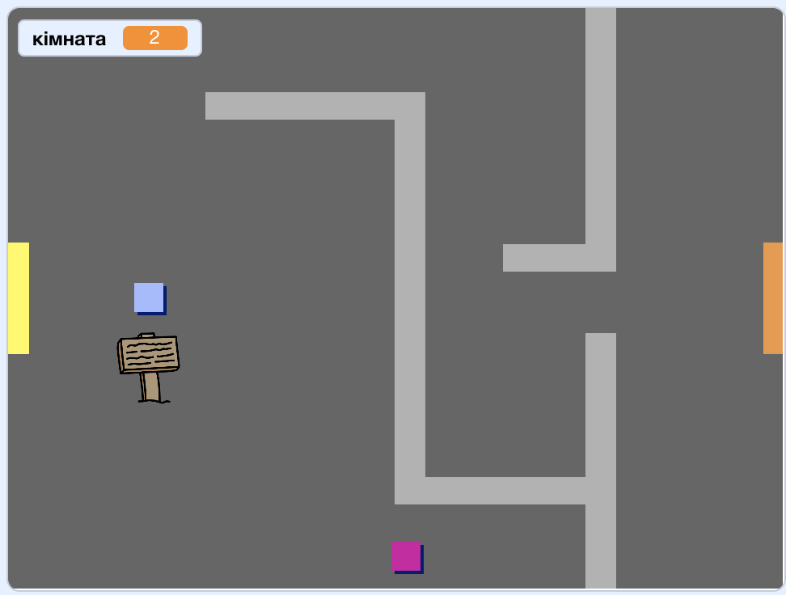

## Переміщення по світу

Спрайт `гравець` повинен мати можливість проходити через двері в інші кімнати.

Твій проєкт містить фони для інших кімнат:


\--- task \---

Створи нову змінну для всіх спрайтів з іменем `кімната`{:class="block3variables"} для відслідковування, у якій з кімнат знаходиться спрайт `гравець`.

[[[generic-scratch3-add-variable]]]



\--- /task \---

\--- task \---

Коли спрайт `гравець` торкається оранжевих дверей першої кімнати, гра має відобразити наступне тло, а спрайт `гравець` має переміститися назад на лівий край Сцени. Додай цей код всередину циклу `завжди`{:class="block3control"} спрайта `гравець`:


```blocks3
when flag clicked
forever
    if <key (up arrow v) pressed? > then
        point in direction (0)
        move (4) steps
    end
    if <key (left arrow v) pressed? > then
        point in direction (-90)
        move (4) steps
    end
        if <key (down arrow v) pressed? > then
        point in direction (180)
        move (4) steps
    end
        if <key [right arrow v] pressed? > then
        point in direction (90)
        move (4) steps
    end
    if < touching color [#BABABA]? > then
    move (-4) steps
    end
+   if < touching color [#F2A24A] > then
    switch backdrop to (next backdrop v)
    go to x: (-200) y: (0)
    change [room v] by (1)
    end
end
```

\--- /task \---

\--- task \---

При кожному запуску гри кімната, розміщення персонажа та тло мають повертатися на початок.

Додай код **на початку** коду спрайта `гравець` перед циклом `завжди`{:class="block3control"}, щоб, коли натискається зелений прапор, повернути все до початкового стану:

\--- hints \---

\--- hint \---

Коли гра запускається:

+ Значення змінної `кімната`{:class="block3variables"} має бути `1`{:class="block3variables"}
+ `Тлом`{:class="block3looks"} має бути `кімната1`{:class="block3looks"}
+ Розміщення спрайта `гравець` має бути `x: -200 y: 0`{:class="block3motion"}

\--- /hint \---

\--- hint \---

Ось додаткові блоки, що тобі знадобляться:


```blocks3
go to x: (-200) y: (0)

set [room v] to (1)

switch backdrop to (room1 v)
```

\--- /hint \---

\--- hint \---

Ось як має виглядати твій завершений скрипт:


```blocks3
when flag clicked
+set [room v] to (1)
+go to x: (-200) y: (0)
+switch backdrop to (room1 v)
forever
    if <key (up arrow v) pressed? > then
        point in direction (0)
        move (4) steps
    end
    if <key (left arrow v) pressed? > then
        point in direction (-90)
        move (4) steps
    end
        if <key (down arrow v) pressed? > then
        point in direction (180)
        move (4) steps
    end
        if <key [right arrow v] pressed? > then
        point in direction (90)
        move (4) steps
    end
    if < touching color [#BABABA]? > then
    move (-4) steps
    end
    if < touching color [#F2A24A] > then
    switch backdrop to (next backdrop v)
    go to x: (-200) y: (0)
    change [room v] by (1)
end
end
```

\--- /hint \---

\--- /hints \---

\--- /task \---

\--- task \---

Клацни на прапор, а далі переміщуй спрайт `гравець`, поки він не торкнеться до оранжевих дверей. Чи переходить спрайт на наступний екран? Чи значення змінної `кімната`{:class="block3variables"} стає `2`?



\--- /task \---