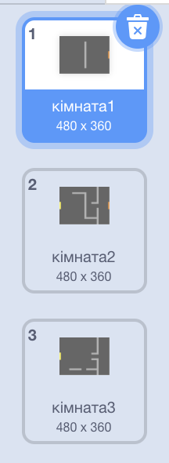
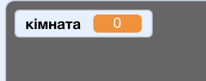
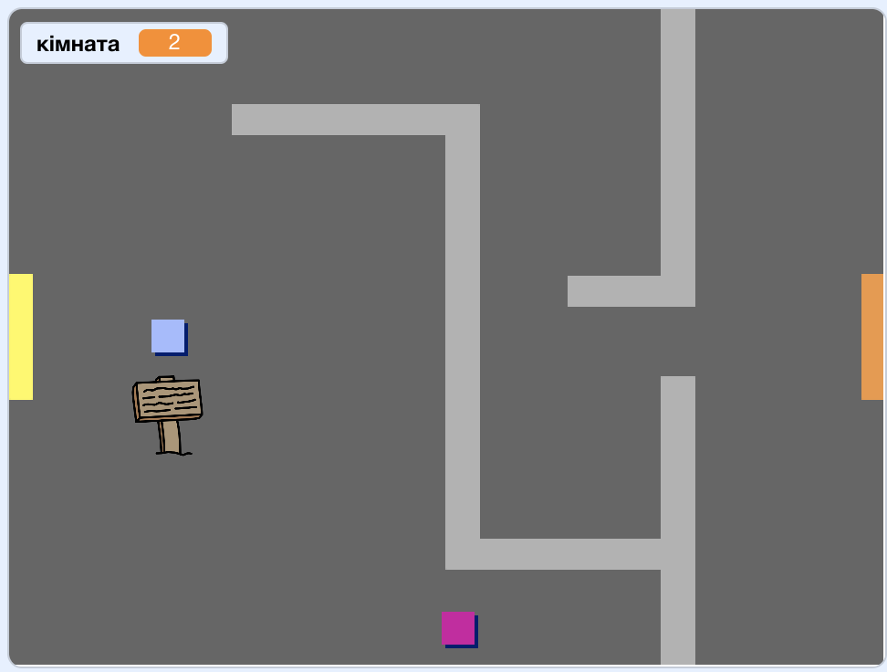

## Змініть свій світ

Давайте дозвольмо `player` ельфу пройти в двері в інші кімнати.

Ваш проект містить резерви для додаткових кімнат:



+ Створіть нову змінну 'for all sprites', яка називається `room` {: class = "blockdata"}, щоб відстежити, в якій кімнаті знаходиться ` player/0> ельф.</li>
</ul>

<p>[[[generic-scratch-add-variable]]]</p>

<p></p>

<ul>
<li>Коли <code>player`ельф торкнеться помаранчевих дверей в першій кімнаті, наступний фон має відображатися, а `player` ельф повинен повернутися до лівої частини сцени. Додайте цей код у цикл вашого `player` sprite's `forever` {:class="blockcontrol"} персонажа:

```blocks
    if < touching color [#F2A24A] > then
        switch backdrop to [next backdrop v]
        go to x: (-200) y: (0)
        change [room v] by (1)
    end
```

+ Додайте цей код до **start** вашого `player` ельфа код (above the `forever`{:class="blockcontrol"} loop), щоб переконатися, що все скидається, коли натиснути прапорець:
    
    ```blocks
        set [room v] to (1)
        go to x: (-200) y: (0)
        switch backdrop to [room1 v]
    ```

+ Натисніть прапорець і перемістіть свого `player` ельфа над помаранчевими дверима. Ваш ельф переходить на наступний екран? Чи `room` {: class = "blockdata"} змінилась на ` 2 `?



-- /challenge \---

### Challange: перехід до попередньої кімнати

+ Ви можете перемістити свого `player` ельфа в попередню кімнату, коли торкається жовтої двері? Код, який вам потрібен для цього, дуже схожий із вже доданим вами кодом для переміщення до наступної кімнати.

\--- /challenge \---