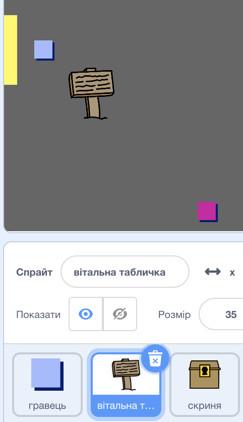
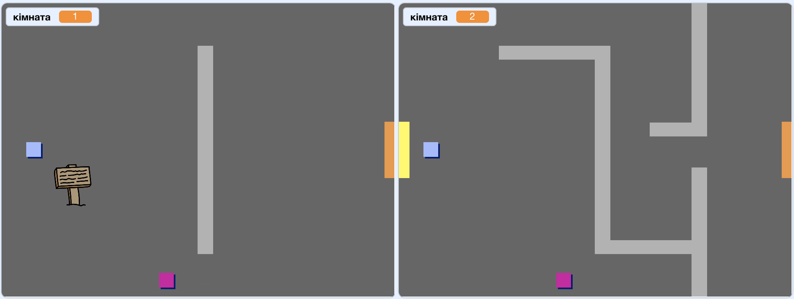
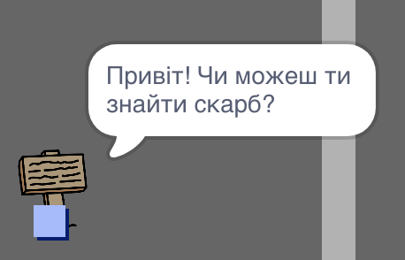

## Знаки

Давайте додамо знаки у вашо світ, щоб керувати гравцем у їхній подорожі.

+ Ваш проект включає `welcome sign`:



+ `welcome sign`ельфа повино бути видно лише в кімнаті 1, тому додайте код до `welcome sign` щоб переконатися, що це відбувається:

```blocks
    when flag clicked
    forever
        if < (room) = [1] > then
            show
        else
            hide
        end
    end
```

+ Перевірте `welcome sign` ельфа, переміщаючи його між кімнатами. Ваш знак має бути видно лише в номері 1.
    
    

+ Знак не дуже добрий, якщо він нічого не говорить! Додайте ще один код для відображення повідомлення, якщо `welcome sign` ельф торкається `player` ельфа:

```blocks
    when flag clicked
    forever
        if < (room) = [1] > then
            show
        else
            hide
        end
        if < touching [player v]?
 
 > then
            say [Welcome! Can you get to the treasure?]
        else
            say []
        end
    end
```

+ Випробуйте свій `welcome sign` - тепер ви повинні побачити повідомлення, коли `player` ельф цього торкається.

