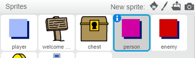
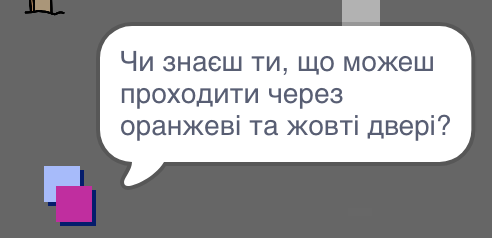

## Люди

Давайте додамо інших людей у ваш світ, з ким ваш ` гравець `ельф може взаємодіяти.

+ Поверніться назад до ельфа



+ Додайте код до `person`, щоб людина розмовляла з ` player` ельф. Цей код дуже схожий з кодом, який ви додали до свого знаку ` ` ельф:

```blocks
    when flag clicked
    go to x: (0) y: (-150)
    forever
        if < touching [player v]? > then
            say [Did you know that you can go through orange and yellow doors?]
        else
            say []
        end
    end
```

+ Ви також можете дозволити своєму `person` ельфу переміщатися, додавши ці два блоки в `else` {: class = "blockcontrol"} до розділу вашого коду:

```blocks
перемістити (1) крок, 
якщо на краю, стрибок
```

Ваш `person` ельф тепер рухатиметься, але перестане говорити з `player` ельф.



\--- challenge \---

### Challange: Вдосконалення неба

Чи можете ви додати код до `person` так, щоб вони з'являлися тільки в номері 1? Переконайтеся, що ви перевірили новий код.

\--- /challenge \---