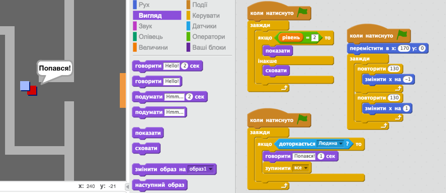

\--- challenge \---

## Виклик: додати ворога

Ви також можете додати патрулюючих ворогів. Якщо гравець торкається ворога, гра закінчується.

+ Додайте код до `enemy` так, щоб він з'явився лише в номері 2.

+ Додайте код, щоб перемістити `enemy` ельфа, і закінчити гру, якщо `enemy` ельф торкається `enemy` ельфа. Простіше зробити це в окремих блоках коду. Ось як ваш `enemy` ельф код може виглядати:

+ + його видно лише в номері 2
    + Він патрулює кімнату
    + Гра закінчується, якщо `player` ельф торкається цього

-- /challenge \---

\--- challenge \---

## Challenge: більше ворогів

Ви можете створити іншого `enemy` в кімнаті 3, який патрулює вгору і вниз через розрив у стіні?

\--- /challenge \---