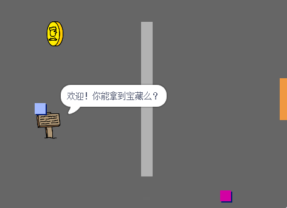

--无打印--

这是该项目的 **Scratch 3** 版本。 项目</a>还有一个 Scratch 2版本。
 

\--- /no-print \---

## 简介

在这个项目中，您将学习如何创建自己的冒险游戏世界，探索多个级别。

### 学习成果

--无打印--

单击绿色标志开始。 使用箭头键在世界中移动角色。

  <iframe allowtransparency="true" width="485" height="402" src="https://scratch.mit.edu/projects/embed/258757783/?autostart=false" frameborder="0" scrolling="no"></iframe>
  

\--- /no-print \---

\--- print-only \---

您将使用箭头键在世界中移动角色。 

\--- /print-only \---

## \--- collapse \---

## title: 你需要准备什么

### 硬件

- 一台能够运行Scratch 3的电脑

### 软件

- Scratch 3（[在线版本](http://rpf.io/scratchon){:target="_blank"}或[离线版本](http://rpf.io/scratchoff){:target="_blank"}）

### 下载

您可以在 [rpf.io/p/en/create-your-own-world-go](https://rpf.io/p/en/create-your-own-world-go)找到完成此项目所需的一切。

\--- /collapse \---

## \--- collapse \---

## title: 你将学到什么

- 使用条件选择来对按键做出反应
- 使用变量来存储游戏的状态
- 根据变量的值使用条件选择
- 使用列表存储数据

\--- /collapse \---

## \--- collapse \---

## title: 教师附加信息

如果您需要打印本项目文件，请使用[适合打印版本](https://projects.raspberrypi.org/en/projects/create-your-own-world/print){:target="_blank"}。

你可以在这里找到 [完成的项目](https://rpf.io/p/en/create-your-own-world-get){:target="_blank"}。

\--- /collapse \---