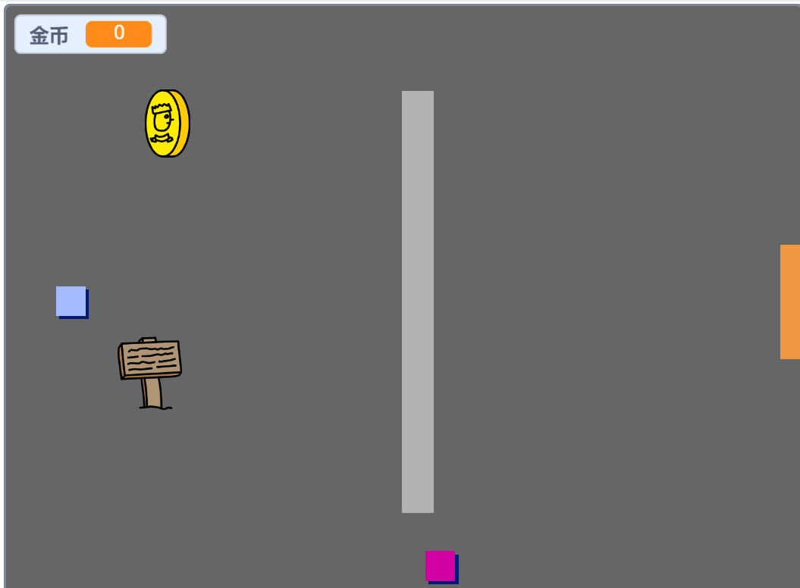

## 挑战：扩展你的世界

您现在可以继续创建自己的世界！ 以下是一些想法：

+ 在不同的房间为您的游戏添加更多硬币。 你可以让一些硬币被巡逻的敌人守卫吗？
+ 改变游戏的背景
+ 为您的游戏添加声音和音乐
+ 添加更多人，敌人和标志
+ 添加红色和黄色门，以及打开它们的特殊键
+ 为您的世界添加更多房间
+ 在游戏中添加其他有用的项目
    
    + 使用硬币从其他人那里获取信息：


+ 您甚至可以在房间1的北墙和南墙上添加门，这样玩家就可以在四个方向的房间之间移动。 例如，您的游戏可以在3×3网格中拥有9个房间。 然后，您可以将 `3` 添加到房间号码以向下移动一个级别。




```blocks3
如果 <touching color [ ]?> 然后
切换背景为（（服装[编号v]）+（3））
转到x：（0）y：（200）
改变[房间v]乘以（3）
```