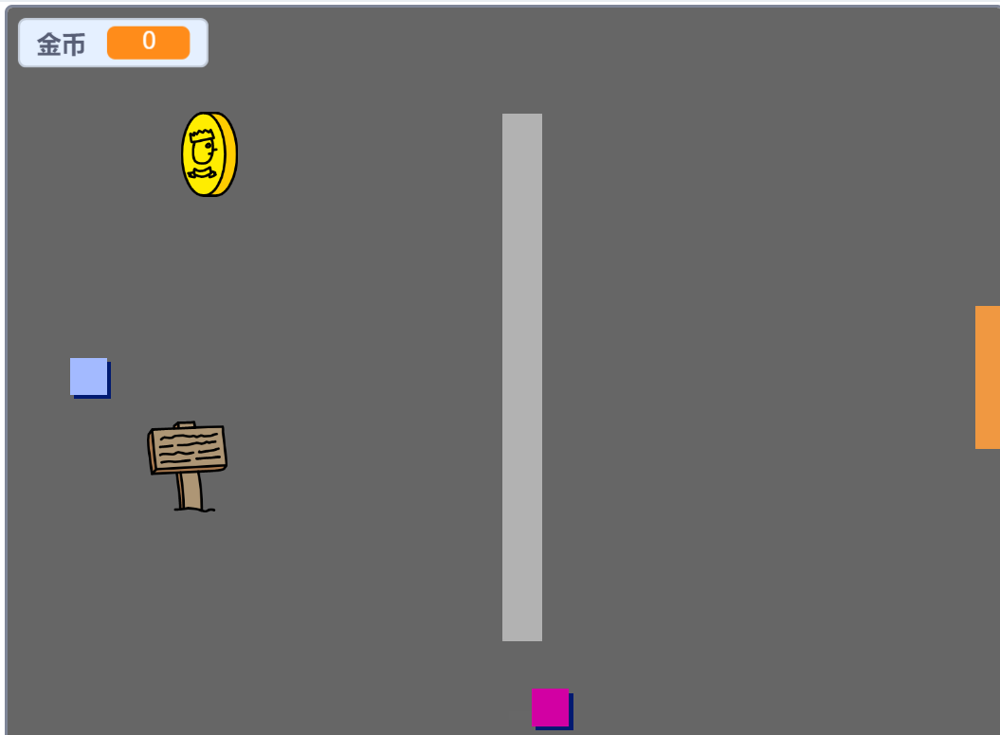

## 挑战：扩展你的世界

你现在可以继续创建你自己的世界！以下是一些想法： 以下是一些想法：

+ 在不同的房间为您的游戏添加更多硬币。 你可以让一些硬币被巡逻的敌人守卫吗？
+ 更改你的游戏设置，并更改你的游戏图像
+ 向你的游戏添加声音和音乐
+ 添加更多人物、敌人、标志和硬币
+ 添加红色和黄色房门，以及开启这些门的特殊钥匙
+ 向你的世界添加更多房间
+ 向你的游戏添加其他有用的物品
    
    + 使用硬币从其他人物那里获取信息：


+ 你甚至可以在房间 1 的北墙和南墙上添加房门，这样玩家便可在四个方向上的房间之间移动。例如，如果你有九个房间，你可以考虑将它们以 3×3 的网格状排列。然后，你可以将房间数量增加 `3` 来下移一级。 例如，您的游戏可以在3×3网格中拥有9个房间。 然后，您可以将 `3` 添加到房间号码以向下移动一个级别。




```blocks3
如果 <touching color [ ]?> 那么
换成((costume [number v]) + (3)) 造型
移到x:(0) y:(200)
将 [room v] 设为 (3)
```