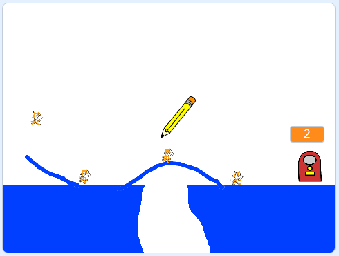

## 接下来还有什么？

通过 [CATS开始创建另一个游戏！](https://projects.raspberrypi.org/en/projects/cats?utm_source=pathway&utm_medium=whatnext&utm_campaign=projects) 项目。

\--- no-print \---

点击并用鼠标拖动以用铅笔绘制一条线。 您的目标是通过创建通往出口的安全路径来阻止猫掉入洞中。

  <iframe allowtransparency="true" width="485" height="402" src="https://scratch.mit.edu/projects/embed/253667883/?autostart=false" frameborder="0" scrolling="no"></iframe>

\--- /no-print \---

\--- print-only \---

\--- /print-only \---

如果要使用Python而不是Scratch制作游戏，请尝试[ RPG ](https://projects.raspberrypi.org/en/projects/rpg?utm_source=pathway&utm_medium=whatnext&utm_campaign=projects)项目。