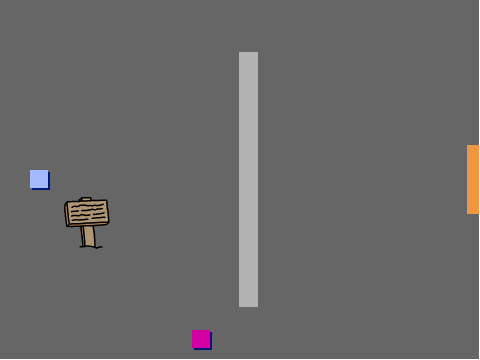

## 你将需要什么

首先创建一个可以在你的世界中移动的 `玩家` 角色。

\--- task \---

打开“创建自己的世界”的Scratch初始项目。

**Online**: open the online starter project at [rpf.io/create-your-own-world-on](https://rpf.io/create-your-own-world-on){:target="_blank"}.

如果您有Scratch帐户，可以单击 **Remix** 制作副本。

**Offline**: download the starter project [rpf.io/p/en/create-your-own-world-go](https://rpf.io/p/en/create-your-own-world-go){:target="_blank"}, and then open it using the offline editor. Scratch 2.0（[在线](https://scratch.mit.edu/projects/editor/){:target="_blank"} 或 [离线](https://scratch.mit.edu/scratch2download/){:target="_blank"}）



\--- /task \---

按箭头键应该移动 `玩家` 角色。 当按下向上箭头时，`玩家` 角色应该在舞台上向上移动以作出响应。

\--- task \---

将此代码添加到 `玩家` 角色：


```blocks3
当绿旗被点击
重复执行
    如果 < 按下 (向上箭头) 键? > 那么
        面向 (0) 方向
        移动 (4) 步
    结束
结束
```

\--- /task \---

\--- task \---

单击绿旗标志，然后按住向上箭头。 `玩家` 角色会向上移动吗？


\--- /task \---

\--- task \---

若要将 `玩家` 角色移至左边，您需要添加另一个 `如果`{:class="block3control"} 代码块，类似于这样：


```blocks3
当绿旗被点击
重复执行
    如果 <按下 (向上箭头) 键? > 那么
        面向 (0) 方向
        移动 (4) 步
    结束
+   如果 <按下 (向左箭头) 键？ > 那么
        面向 (-90) 方向
        移动 (4) 步
    结束
结束
```

\--- /task \---

\--- task \---

为你的 `玩家` 角色添加更多代码，这样它也可以向下和向右移动。 使用您已有的代码来帮助您。

\--- hint \---

\--- hint \---

要向上移动，你将 `玩家` 角色面向 `0` 度方向。 你需要怎么做使角色向下移动？

要向左移动，你将角色面向 `-90` 度的方向。 你需要怎么做使角色向右移动？

\--- /hint \---

\--- hint \---

您需要更改这两个块：


```blocks3
<key ( v) pressed>

面向 () 方向
```

复制让`玩家`角色向上移动的代码，然后更改这两个模块使角色向下移动。 再次复制代码，并更改它以使角色向右移动。

\--- /hint \---

\--- hint \---

现在你的代码应如图所示：


```blocks3
当绿旗被点击
重复执行
    如果 < 按下 (向上箭头) 键? > 那么
        面向  (0) 方向
        移动 (4) 步
    结束
+   如果 <按下 (向左箭头) 键？ > 那么
        面向 (-90度) 方向
        移动 (4) 步
    结束
+   如果 <按下 (向下箭头) 键？ > 那么
        面向 (180) 方向
        移动 (4) 步
    结束
+   如果 <按下 (向右箭头) 键？ > 那么
        面向 (90) 方向
        移动 (4) 步骤
    结束
结束
```

\--- /hint \---

\--- /hints \---

\--- /task \---