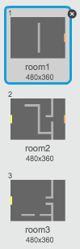
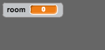
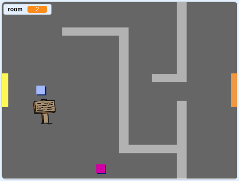

## 坚固的墙壁

`玩家` 角色应该能够通过门进入其他房间。

您的项目包含其他房间的背景：



\--- task \---

创建一个名为 `房间`{：class =“block3variables”}的“适用于所有角色”的变量，以跟踪 `玩家` 角色所在的房间。

[[[generic-scratch3-add-variable]]]



\--- /task \---

\--- task \---

当`玩家`角色碰到第一个房间中的橙色门时，游戏应该显示下一个背景， `玩家`角色应该移到舞台的左侧。 在 `玩家` 角色的`重复执行`{:class="block3control"} 循环中添加此代码：


```blocks3
当绿旗被点击
重复执行
    如果 < 按下(up arrow v)键? > 那么
        面向（0）方向
        移动 (4) 步
    结束
    如果 <按下（left arrow v）键？ > 那么
        面向（-90）方向
        移动（4）步
    结束
        如果 <按下 (down arrow v) 键？ > then
        point in direction (180)
        move (4) steps
    end
        if <key [right arrow v] pressed? > 那么
        面向 (90) 方向
        移动（4）步
    结束
    如果 < 碰到颜色[#BABABA]？ > 那么
    移动（-4）步
    结束
+   如果 < 碰到颜色[＃F2A24A] > 那么
        换成（下一个背景）背景
        移到  x: (-200) y: (0)
        将 [房间] 设为（1）
    结束
结束
```

\--- /task \---

\--- task \---

每次游戏开始时，都需要重置房间，角色位置和背景。

为修复这个问题，你应该在 `玩家` 子图碰到浅灰色墙壁时使其往回移动。以下是你将需要在方向代码块下方的 `永远`{:class="blockcontrol"}代码块内部添加的代码：

\--- hints \---

\--- hint \---

当游戏启动时：

+ 再次测试你的 `玩家` 子图，你可能会注意到他们能够穿过浅灰色的墙壁。
+ `背景`{：class =“block3looks”}应该设置为 `room1`{：class =“block3looks”}
+ `玩家` 角色的位置应该设置为 `x: 200 y: 0`{:class="block3motion"}

\--- /hint \---

\--- hint \---

以下是你需要的代码块：


```blocks3
移到 x: (-200) y: (0)

将 [房间] 设为 (1)

换成 (room1) 背景
```

\--- /hint \---

\--- hint \---

你的代码完成以后应该像这样：


```blocks3
当绿旗被点击
+将 [房间] 设为（1）
+移到 x: (-200) y: (0)
+换成 (room1) 背景
重复执行
    如果 < 按下 (up arrow v) 键 ？ > 那么
        面向(0)方向
        移动 (4) 步
    结束
+   如果 <按下(left arrow v)键？ > 那么
        面向(-90)方向
        移动(4)步
    结束
        如果 <按下 (down arrow v) 键？ > then
        point in direction (180)
        move (4) steps
    end
        if <key [right arrow v] pressed? > 那么
        面向(90)方向
        移动(4)步
    结束
    如果 < 碰到颜色[#BABABA]？ > 那么
    移动(-4）步
    结束
    如果 < 碰到颜色[＃F2A24A] > 那么
    换成（下一个背景）背景
    移到  x: (-200) y: (0)
    将 [房间] 设为(1)
    结束
结束
```

\--- /hint \---

\--- /hints \---

\--- /task \---

\--- task \---

点击绿旗，然后移动你的`玩家` 角色直到碰到橙色的门。 角色会移动到下一个屏幕吗？ `房间` {：class =“ block3variables”}变量是否更改为` 2 ` ？



\--- /task \---