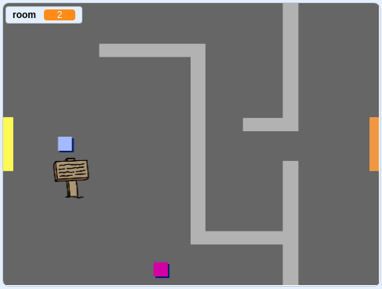

## 走动你的世界

`玩家` 精灵应该能够通过门进入其他房间。

您的项目包含其他房间的背景：


\--- task \---

创建一个名为 `room`{：class =“block3variables”}的新“for all sprite”变量，以跟踪 `玩家` 精灵所在的房间。

[[[generic-scratch3-add-variable]]]


\--- /task \---

\--- task \---

When the `player` sprite touches the orange door in the first room, the game should display the next backdrop, and the `player` sprite should move back to the left side of the Stage. Add this code inside the `player` sprite's `forever`{:class="block3control"} loop:


```blocks3
当标志点击
永久
    如果按下 <键（向上箭头v）？ > 然后
        点方向（0）
        移动（4）步骤
    结束
    如果按下 <键（左箭头v）？ > 然后
        点方向（-90）
        移动（4）步骤
    结束
        如果按下 <键（向下箭头v）？ > 然后
        点方向（-180）
        移动（4）步骤
    结束
        如果按下 <键[右箭头v]？ > 然后
        点方向（90）
        移动（4）步骤
    结束
    如果 < 接触颜色[#BABABA]？ > 然后
    移动（-4）步骤
    结束
+如果 < 触摸颜色[＃F2A24A] > 然后
    切换背景到（下一个背景v）
    转到x：（ -  200）y：（0）
    改变[房间] v] by（1）
    end
end
```

\--- /task \---

\--- task \---

Every time the game starts, the room, character position, and backdrop need to be reset.

Add code to the **start** of your `player` sprite code above the `forever`{:class="block3control"} loop, to reset everything when the flag is clicked:

\--- hints \---

\--- hint \---

When the game starts:

+ `room`{：class =“block3variables”}的值应设置为 `1`{：class =“block3variables”}
+ `背景`{：class =“block3looks”}应该设置为 `room1`{：class =“block3looks”}
+ The position of the `player` sprite should be set to `x: -200 y: 0`{:class="block3motion"}

\--- /hint \---

\--- hint \---

Here are the extra blocks you need:


```blocks3
转到x：（ -  200）y：（0）

设置[房间v]到（1）

切换背景到（房间1 v）
```

\--- /hint \---

\--- hint \---

Here's what your finished script should look like:


```blocks3
当标志点击
+设置[房间v]到（1）
+转到x：（ -  200）y：（0）
+切换背景到（room1 v）
永远
    如果按下 <键（向上箭头v） ？ > 然后
        点方向（0）
        移动（4）步骤
    结束
    如果按下 <键（左箭头v）？ > 然后
        点方向（-90）
        移动（4）步骤
    结束
        如果按下 <键（向下箭头v）？ > 然后
        点方向（-180）
        移动（4）步骤
    结束
        如果按下 <键[右箭头v]？ > 然后
        点方向（90）
        移动（4）步骤
    结束
    如果 < 接触颜色[#BABABA]？ > 然后
    移动（-4）步骤
    结束
    如果 < 触摸颜色[＃F2A24A] > 然后
    切换背景到（下一个背景v）
    转到x：（ -  200）y：（0）
    改变[房间v ]由（1）
结束
结束
```

\--- /hint \---

\--- /hints \---

\--- /task \---

\--- task \---

Click the flag, and then move your `player` sprite until it touches the orange door. Does the sprite move to the next screen? Does the `room`{:class="block3variables"} variable change to `2`?



\--- /task \---