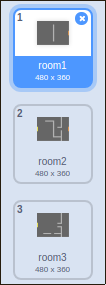

## 走动你的世界

`玩家` 精灵应该能够通过门进入其他房间。

您的项目包含其他房间的背景：



\--- task \---

创建一个名为 `room`{：class =“block3variables”}的新“for all sprite”变量，以跟踪 `玩家` 精灵所在的房间。

[[[generic-scratch3-add-variable]]]

 \--- /task \---

\--- task \--- 当 `玩家` 精灵触及第一个房间的橙色门时，游戏应该显示下一个背景， `玩家` 精灵应该移回舞台的左侧。 将此代码添加到 `player` 精灵 `永远`{：class =“block3control”}循环中：


```blocks3
当标志点击
永久
    如果按下 <键（向上箭头v）？ > 然后
        点方向（0）
        移动（4）步骤
    结束
    如果按下 <键（左箭头v）？ > 然后
        点方向（-90）
        移动（4）步骤
    结束
        如果按下 <键（向下箭头v）？ > 然后
        点方向（-180）
        移动（4）步骤
    结束
        如果按下 <键[右箭头v]？ > 然后
        点方向（90）
        移动（4）步骤
    结束
    如果 < 接触颜色[#BABABA]？ > 然后
    移动（-4）步骤
    结束
+如果 < 触摸颜色[＃F2A24A] > 然后
    切换背景到（下一个背景v）
    转到x：（ -  200）y：（0）
    改变[房间] v] by（1）
    end
end
```

\--- /task \---

\---任务\--- 每次游戏开始时，需要重置房间，角色位置和背景。

将代码添加到 `永远`{{class =“block3control”}循环上方的 `玩家` 精灵代码的 **开始** ，以便在单击该标志时重置所有内容：

\---提示\--- \---提示\--- 游戏开始时：

+ `room`{：class =“block3variables”}的值应设置为 `1`{：class =“block3variables”}
+ `背景`{：class =“block3looks”}应该设置为 `room1`{：class =“block3looks”}
+ `玩家` 精灵的位置应该设置为 `x：-200 y：0`{：class =“block3motion”} \--- /提示\--- \---提示\--- 这是额外的您需要的块：


```blocks3
转到x：（ -  200）y：（0）

设置[房间v]到（1）

切换背景到（房间1 v）
```

\--- /提示\--- \---提示\--- 这是你完成的脚本应该是这样的：


```blocks3
当标志点击
+设置[房间v]到（1）
+转到x：（ -  200）y：（0）
+切换背景到（room1 v）
永远
    如果按下 <键（向上箭头v） ？ > 然后
        点方向（0）
        移动（4）步骤
    结束
    如果按下 <键（左箭头v）？ > 然后
        点方向（-90）
        移动（4）步骤
    结束
        如果按下 <键（向下箭头v）？ > 然后
        点方向（-180）
        移动（4）步骤
    结束
        如果按下 <键[右箭头v]？ > 然后
        点方向（90）
        移动（4）步骤
    结束
    如果 < 接触颜色[#BABABA]？ > 然后
    移动（-4）步骤
    结束
    如果 < 触摸颜色[＃F2A24A] > 然后
    切换背景到（下一个背景v）
    转到x：（ -  200）y：（0）
    改变[房间v ]由（1）
结束
结束
```

\--- /提示\--- \--- /暗示\---

\--- /task \---

\---任务\--- 单击标志，然后移动你的 `玩家` 精灵，直到它触及橙色门。 精灵会移动到下一个屏幕吗？ `室`{：class =“block3variables”}变量是否变为 `2`？

 \--- /task \---