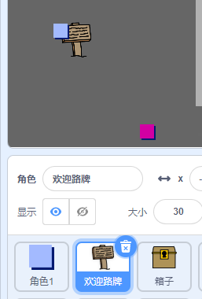
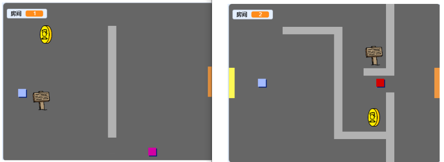
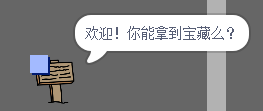

## 标志

现在为您的世界添加标志，以指导玩家的旅程。

您的项目包含 `欢迎标志` 精灵：



\--- task \--- `欢迎标志` 精灵应该只在房间1中可见，所以在sprite中添加一些代码以确保发生这种情况：

\---提示\--- \---提示\--- `当点击标志`{：class =“block3events”}时，在 `永远的`{：class =“block3control”}循环中，检查 `是否为`{：class =“block3control”} `房间是1`{：class =“block3variables”}，在这种情况下 `显示`{：class =“block3looks”} `欢迎标志` 精灵， `其他`{：class = “block3control”} `隐藏`{：class =“block3looks”}精灵。 \--- /提示\--- \---提示\--- 以下是您需要的块：


```blocks3
<br />if &lt; &gt; then
else
end

&lt; （room :: variables）= [1] &gt;

hide

show

forever
end

when flag clicked

```

\--- /提示\--- \---提示\--- 这是完整的代码：


```blocks3
当标志点击
永远
    如果 < （房间::变量）= [1] > 然后
        显示
    其他
        隐藏
    结束
结束
```

\--- /提示\--- \--- /暗示\---

\--- /task \---

\--- task \--- 通过在房间之间移动来测试 `欢迎标志` 精灵的代码。 标志应仅在房间1中可见。

 \--- /task \---

\---任务\--- 如果没有说什么，那么标志就不是很好！ 如果 `欢迎标志` 精灵正在触及 `玩家` 精灵，请添加一些代码来显示消息：


```blocks3
当标志点击
永远
如果 < （房间::变量）= [1] > 然后
显示
否则
隐藏
结束
+如果 < 触摸（玩家v）？ > 然后
说[欢迎！ 你能得到宝藏吗？]
其他
说[]
结束
结束
```

\--- /task \---

\---任务\--- 再次测试你的 `欢迎标志` 精灵。 现在，当 `玩家` 精灵触及 `欢迎标志` 精灵时，您应该会看到一条消息。

 \--- /task \---