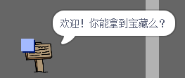

## 标志

现在为您的世界添加标志，以指导玩家的旅程。

你的项目包括一个 `欢迎标志` 子图：


\--- task \---

`欢迎标志` 子图只应在房间 1 中可见，因此向 `欢迎标志` 子图添加一些代码以确保实现这一点：

\--- hints \---

\--- hint \---

`当绿旗被点击`{:class="block3events"},在`重复执行`{:class="block3control"}的循环中判断，`如果`{:class="block3control"} `房间是1`{:class="block3variables"} 则`显示`{:class="block3looks"}`欢迎标志`角色，`否则`{:class="block3control"} `隐藏`{:class="block3looks"}该角色。

\--- /hint \---

\--- hint \---

以下是你需要的代码块：


```blocks3
<br />如果 <> 那么
否则
结束

< (room:: variables) = [1] >

隐藏

显示

重复执行
结束

当绿旗被点击

```

\--- /hint \---

\--- hint \---

这是完整的代码：


```blocks3
当绿旗被点击
重复执行
    如果 < (room :: variables)= [1] > 那么
        显示
    否则
        隐藏
    结束
结束
```

\--- /hint \---

\--- /hints \---

\--- /task \---

\--- task \---

通过在房间之间移动来测试你的 `欢迎标志` 子图。你的标志只应在房间 1 中可见。 这个标志只会在房间1显示。


\--- /task \---

\--- task \---

一个欢迎标志如果不说点什么是不是不太好？ 一个标志如果不能表示点什么，则没有多大用处！添加更多代码，使 `欢迎标志` 子图触碰到 `玩家` 子图时显示一条信息：


```blocks3
当绿旗被点击
重复执行
如果 < (room :: variables)= [1] > 那么
显示
否则
隐藏
结束
+如果 < 碰到(player v)? > 那么
说[欢迎！ 你能得到宝藏吗？]
否则
说 []
结束
结束
```

\--- /task \---

\--- task \---

再次测试你的`欢迎标志`角色。 现在，当`玩家`碰到`欢迎标志`时，你会看到一条提示信息。



\--- /task \---