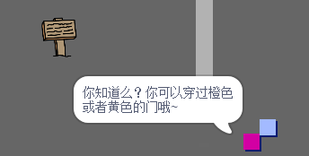

## 人物

将您的 `玩家` 精灵可以与之互动的其他人添加到您的世界。

\--- task \---

Switch to the `person` sprite.


\--- /task \---

\--- task \---

Add some code to the `person` sprite so that the person talks to the `player` sprite. This code is very similar to the code you added to your `sign` sprite:


```blocks3
当标志点击
转到x：（0）y：（ -  150）
永远
    如果 < 触及（玩家v）？ > 然后
        说[你知道你可以通过橙色和黄色的门吗？]
    其他
        说[]
    结束
结束
```

\--- /task \---

\--- task \---

Allow your `person` sprite to move by adding these two blocks in the `else`{:class="block3control"} section of your code:


```blocks3
当标志点击
转到x：（0）y：（ -  150）
永远
    如果 < 触及（玩家v）？ > 然后
        说[你知道你可以通过橙色和黄色的门吗？]
    其他
        说[]
+移动（1）步骤
+如果在边缘，反弹
    结束
结束
```

\--- /task \---

Your `person` sprite will now move, but will stop to talk to the `player` sprite.



\--- task \---

Add code to your new `person` sprite so that the sprite only appears in room 1. The code you need is exactly the same as the code that makes the `sign` sprite only visible in room 1.

Make sure you test out your new code.

\--- /task \---