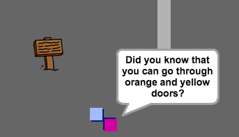

## 人物

让我们来向你的世界添加一些其他人物，你的 `玩家` 子图可与之进行互动。

\--- task \---

切换至 `人物` 子图。


\--- /task \---

\--- task \---

在`人物`角色中添加一些代码，使它可以与`玩家`对话。 这个代码和之前在`欢迎标志`角色中的代码非常相似。


```blocks3
当绿旗被点击
移到x: (0) y: (-150)
重复执行
    如果 < 碰到 (player v)? > 那么
        说[你知道你可以通过橙色和黄色的门吗？]
    否则
        说[]
    结束
结束
```

\--- /task \---

\--- task \---

你还可以通过在你代码的 `否则`{:class="blockcontrol"}部分添加这两个代码块，让你的 `人物` 子图移动：


```blocks3
当绿旗被点击
移到x: (0) y: (-150)
重复执行
    如果 < 碰到 (player v)? > 那么
        说[你知道你可以通过橙色和黄色的门吗？]
    否则
        说[]
+       移动 (1) 步
+       碰到边缘就反弹
    结束
结束
```

\--- /task \---

你的 `人物` 子图现在将会移动，但会停下来和 `玩家` 子图交谈。



\--- task \---

添加新的代码到`人物`角色中使角色只出现在房间1中。 其中所需要的代码和`欢迎标志`角色中的仅房间1显示相同。

完成以后，确保测试一下你的新代码。

\--- /task \---