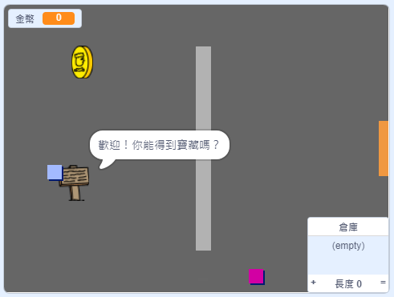

\---沒有印刷\---

這是該項目的 **Scratch 3** 版本。 項目</a>還有一個 Scratch 2版本。
 

\--- /無印刷\---

## 介紹

在這個項目中，您將學習如何創建自己的冒險遊戲世界，探索多個級別。

### 你要做什麼

\---沒有印刷\---

單擊綠色標誌開始。 使用箭頭鍵在世界中移動角色。

  <iframe allowtransparency="true" width="485" height="402" src="https://scratch.mit.edu/projects/embed/258757783/?autostart=false" frameborder="0" scrolling="no"></iframe>
  

\--- /無印刷\---

\---只打印\---

您將使用箭頭鍵在世界中移動角色。 

\--- /僅打印\---

## - - 坍方 - -

## 標題：你需要什麼

### 硬件

- 能夠運行Scratch 3的計算機

### 軟件

- 從頭開始3（ [在線](http://rpf.io/scratchon){：target =“_ blank”}或 [離線](http://rpf.io/scratchoff){：target =“_ blank”}）

### 下載

您可以在 [rpf.io/p/en/create-your-own-world-go](https://rpf.io/p/en/create-your-own-world-go)找到完成此項目所需的一切。

- - /坍方 - -

## - - 坍方 - -

## 標題：你將學到什麼

- 使用條件選擇來對按鍵做出反應
- 使用變量來存儲遊戲的狀態
- 根據變量的值使用條件選擇
- 使用列表存儲數據

- - /坍方 - -

## - - 坍方 - -

## 標題：教育工作者的附加信息

如果您需要打印此項目，請使用 [打印機友好版本](https://projects.raspberrypi.org/en/projects/create-your-own-world/print){：target =“_ blank”}。

您可以在 [rpf.io/p/en/create-your-own-world-get](https://rpf.io/p/en/create-your-own-world-get)找到該項目的解決方案。

- - /坍方 - -