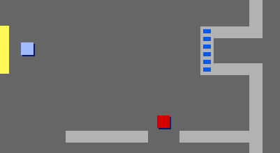

## 門和鑰匙

Now you are going to add code so that some of the doors in your game world are locked, and the player must find the key to open them and get to the next room.

\--- task \--- 切換到 `鍵` 精靈。 在Scripts菜單中單擊 `show`{：class =“blocklooks”}，以便精靈出現在舞台上。 \--- /任務\---

\---任務\--- 編輯 `鍵` 精靈的服裝，使其為藍色。 \--- /任務\---

\---任務\--- 將舞台背景切換到3號房間，並將 `鍵` 精靈放置在難以觸及的地方！


\--- /任務\---

\--- task \--- 將代碼添加到 `鍵` 精靈中，使其僅在3號房間可見。 \--- /任務\---

\--- task \--- 創建一個名為 `inventory`{：class =“block3variables”}的新列表來存儲你的 `玩家` 精靈收集的物品。

[[[generic-scratch3-make-list]]] \--- /任務\---

\--- task \--- 你需要添加的用於收集密鑰的代碼與收集硬幣的代碼非常相似。 不同之處在於您將密鑰添加到 `清單`{：class =“block3variables”}。


```blocks3
當標記點擊
等待 <touching (player v)?>
添加[藍色鍵]到[庫存v]
隱藏
停止[其他腳本在精靈v]
```

\--- /任務\---

\--- task \--- 在遊戲開始時向舞台添加代碼以清空庫存。

```blocks3
刪除[所有v]的[庫存v]
```

\--- /任務\---

\---任務\--- 測試你的遊戲，檢查你是否可以收集 `鍵` 精靈並將其添加到你的庫存。 \--- /任務\---

\---任務\--- 現在添加鎖著的門。 選擇 `door-blue` sprite並在Scripts菜單中單擊 `show`{：class =“blocklooks}，然後將精靈定位在兩個牆之間的間隙上。

 \--- /任務\---

\--- task \--- 將代碼添加到 `門 - 藍` 精靈中，使其僅在3號房間可見。 \--- /任務\---

\--- task \--- 將代碼添加到 `門藍` 精靈中，這樣，當密鑰在 `庫存`{：class =“block3variables”}中時，精靈 `隱藏`{：class =“block3looks “}允許你的 `玩家` 精靈通過。


```blocks3
當標誌點擊
等待 <[庫存v]包含[藍鍵]？>
停止[精靈v中的其他腳本]
隱藏
```

\--- /任務\---

\---任務\--- 測試你的遊戲，看看你是否可以收集藍鍵來打開門！ \--- /任務\---