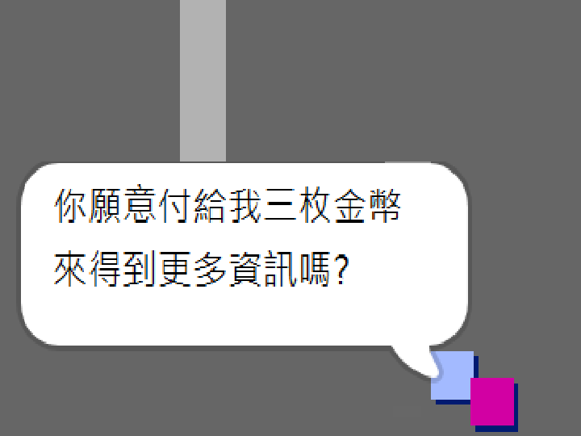
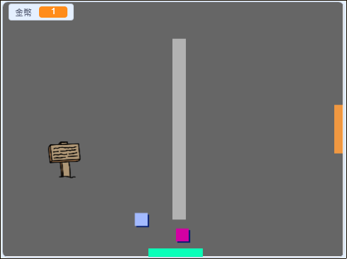

## 挑戰：拓展你的世界

您現在可以繼續創建自己的世界！ 以下是一些想法：

+ 在不同的房間為您的遊戲添加更多硬幣。 你可以讓一些硬幣被巡邏的敵人守衛嗎？
+ 改變遊戲的背景
+ 為您的遊戲添加聲音和音樂
+ 添加更多人，敵人和標誌
+ 添加紅色和黃色門，以及打開它們的特殊鍵
+ 為您的世界添加更多房間
+ 在遊戲中添加其他有用的項目
    
    + 使用硬幣從其他人那裡獲取信息：



+ 您甚至可以在房間1的北牆和南牆上添加門，這樣玩家就可以在四個方向的房間之間移動。 例如，您的遊戲可以在3×3網格中擁有9個房間。 然後，您可以將 `3` 添加到房間號碼以向下移動一個級別。

 

```blocks3
如果 <touching color [ ]?> 然後
切換背景為（（服裝[編號v]）+（3））
轉到x：（0）y：（200）
改變[房間v]乘以（3）
```