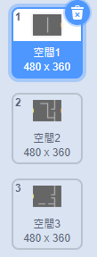
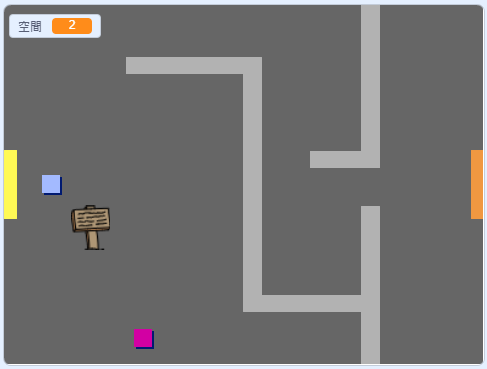

## 走動你的世界

`玩家` 精靈應該能夠通過門進入其他房間。

您的項目包含其他房間的背景：



\---任務\---

創建一個名為 `room`{：class =“block3variables”}的新“for all sprite”變量，以跟踪 `玩家` 精靈所在的房間。

[[[generic-scratch3-add-variable]]]


\--- /task \---

\--- task \---

When the `player` sprite touches the orange door in the first room, the game should display the next backdrop, and the `player` sprite should move back to the left side of the Stage. Add this code inside the `player` sprite's `forever`{:class="block3control"} loop:


```blocks3
當標誌點擊
永久
    如果按下 <鍵（向上箭頭v）？ > 然後
        點方向（0）
        移動（4）步驟
    結束
    如果按下 <鍵（左箭頭v）？ > 然後
        點方向（-90）
        移動（4）步驟
    結束
        如果按下 <鍵（向下箭頭v）？ > 然後
        點方向（-180）
        移動（4）步驟
    結束
        如果按下 <鍵[右箭頭v]？ > 然後
        點方向（90）
        移動（4）步驟
    結束
    如果 < 接觸顏色[#BABABA]？ > 然後
    移動（-4）步驟
    結束
+如果 < 觸摸顏色[＃F2A24A] > 然後
    切換背景到（下一個背景v）
    轉到x：（ -  200）y：（0）
    改變[房間] v] by（1）
    end
end
```

\--- /task \---

\--- task \---

Every time the game starts, the room, character position, and backdrop need to be reset.

Add code to the **start** of your `player` sprite code above the `forever`{:class="block3control"} loop, to reset everything when the flag is clicked:

\--- hints \---

\--- hint \---

When the game starts:

+ `room`{：class =“block3variables”}的值應設置為 `1`{：class =“block3variables”}
+ `背景`{：class =“block3looks”}應該設置為 `room1`{：class =“block3looks”}
+ The position of the `player` sprite should be set to `x: -200 y: 0`{:class="block3motion"}

\--- /hint \---

\--- hint \---

Here are the extra blocks you need:


```blocks3
轉到x：（ -  200）y：（0）

設置[房間v]到（1）

切換背景到（房間1 v）
```

\--- /hint \---

\--- hint \---

Here's what your finished script should look like:


```blocks3
當標誌點擊
+設置[房間v]到（1）
+轉到x：（ -  200）y：（0）
+切換背景到（room1 v）
永遠
    如果按下 <鍵（向上箭頭v） ？ > 然後
        點方向（0）
        移動（4）步驟
    結束
    如果按下 <鍵（左箭頭v）？ > 然後
        點方向（-90）
        移動（4）步驟
    結束
        如果按下 <鍵（向下箭頭v）？ > 然後
        點方向（-180）
        移動（4）步驟
    結束
        如果按下 <鍵[右箭頭v]？ > 然後
        點方向（90）
        移動（4）步驟
    結束
    如果 < 接觸顏色[#BABABA]？ > 然後
    移動（-4）步驟
    結束
    如果 < 觸摸顏色[＃F2A24A] > 然後
    切換背景到（下一個背景v）
    轉到x：（ -  200）y：（0）
    改變[房間v ]由（1）
結束
結束
```

\--- /hint \---

\--- /hints \---

\--- /task \---

\--- task \---

Click the flag, and then move your `player` sprite until it touches the orange door. Does the sprite move to the next screen? Does the `room`{:class="block3variables"} variable change to `2`?



\--- /task \---