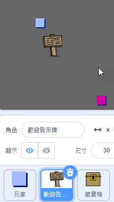
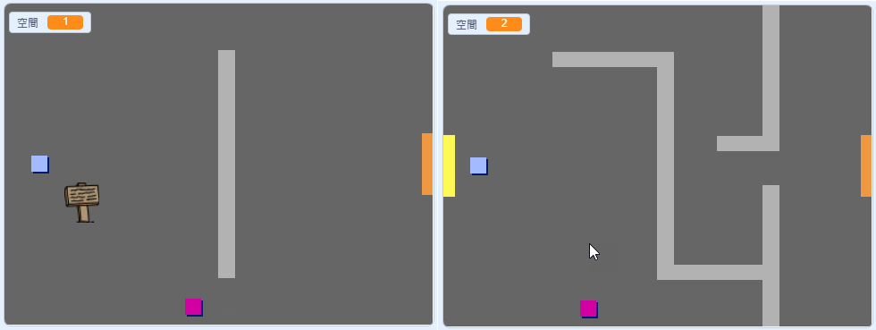
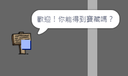

## 跡象

現在為您的世界添加標誌，以指導玩家的旅程。

您的項目包含 `歡迎標誌` 精靈：



\--- task \--- `歡迎標誌` 精靈應該只在房間1中可見，所以在sprite中添加一些代碼以確保發生這種情況：

\---提示\--- \---提示\--- `當點擊標誌`{：class =“block3events”}時，在 `永遠的`{：class =“block3control”}循環中，檢查 `是否為`{：class =“block3control”} `房間是1`{：class =“block3variables”}，在這種情況下 `顯示`{：class =“block3looks”} `歡迎標誌` 精靈， `其他`{：class = “block3control”} `隱藏`{：class =“block3looks”}精靈。 \--- /提示\--- \---提示\--- 以下是您需要的塊：


```blocks3
<br />if < > then
else
end

< （room :: variables）= [1] >

hide

show

forever
end

when flag clicked

```

\--- /提示\--- \---提示\--- 這是完整的代碼：


```blocks3
當標誌點擊
永遠
    如果 < （房間::變量）= [1] > 然後
        顯示
    其他
        隱藏
    結束
結束
```

\--- /提示\--- \--- /暗示\---

\--- /任務\---

\--- task \--- 通過在房間之間移動來測試 `歡迎標誌` 精靈的代碼。 標誌應僅在房間1中可見。

 \--- /任務\---

\---任務\--- 如果沒有說什麼，那麼標誌就不是很好！ 如果 `歡迎標誌` 精靈正在觸及 `玩家` 精靈，請添加一些代碼來顯示消息：


```blocks3
當標誌點擊
永遠
如果 < （房間::變量）= [1] > 然後
顯示
否則
隱藏
結束
+如果 < 觸摸（玩家v）？ > 然後
說[歡迎！ 你能得到寶藏嗎？]
其他
說[]
結束
結束
```

\--- /任務\---

\---任務\--- 再次測試你的 `歡迎標誌` 精靈。 現在，當 `玩家` 精靈觸及 `歡迎標誌` 精靈時，您應該會看到一條消息。

 \--- /任務\---