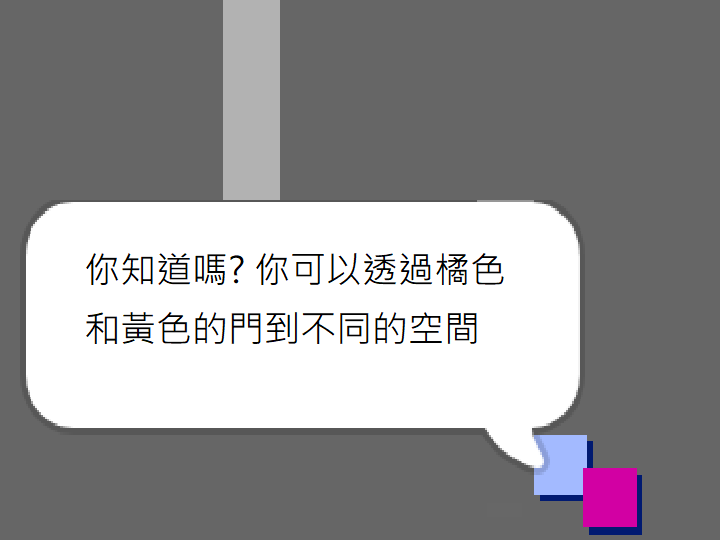

## 人

將您的 `玩家` 精靈可以與之互動的其他人添加到您的世界。

\---任務\--- 切換到 `人` 精靈。

 \--- /任務\---

\---任務\--- 為 `人` 精靈添加一些代碼，以便該人與 `人` 精靈對話。 此代碼與您添加到 `符號` 精靈的代碼非常相似：


```blocks3
當標誌點擊
轉到x：（0）y：（ -  150）
永遠
    如果 < 觸及（玩家v）？ > 然後
        說[你知道你可以通過橙色和黃色的門嗎？]
    其他
        說[]
    結束
結束
```

\--- /任務\---

\--- task \--- 通過在代碼的 `else`{：class =“block3control”}部分添加這兩個塊，允許你的 `個人` 精靈移動：


```blocks3
當標誌點擊
轉到x：（0）y：（ -  150）
永遠
    如果 < 觸及（玩家v）？ > 然後
        說[你知道你可以通過橙色和黃色的門嗎？]
    其他
        說[]
+移動（1）步驟
+如果在邊緣，反彈
    結束
結束

```

\--- /任務\---

你的 `人` 精靈現在會移動，但會停止與 `玩家` 精靈交談。



\--- task \--- 將代碼添加到新的 `人` 精靈中，以便精靈只出現在房間1中。 您需要的代碼與使 `符號` 精靈僅在房間1中可見的代碼完全相同。

確保測試新代碼。 \--- /任務\---